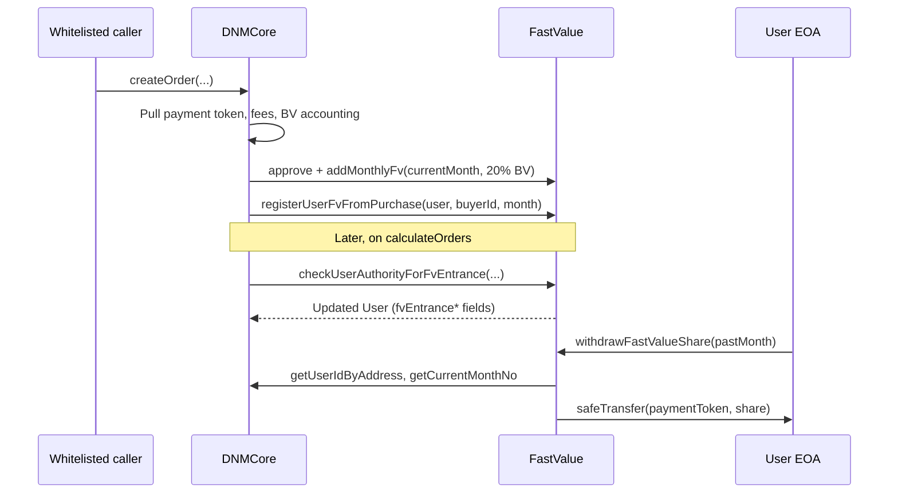

# FastValue (`contracts/fastValue/FastValue.sol`) — Contract Analysis

**Scope:** `FastValue` and all contracts/interfaces it imports (directly or via inheritance). Integration with `DNMCore` is summarized where it defines call flow and trust boundaries.  
**Solidity:** `^0.8.28` (checked arithmetic; `uint` underflow/overflow reverts unless `unchecked` is used — it is not in these files).  
**Generated:** 2026-06-02

---

## 1. Purpose and architecture

**FastValue (FV)** is a separate vault contract that holds the payment token (e.g. USDT) contributed from network purchases and distributes it to qualified users **pro-rata by monthly “shares.”**

- **Funding:** On each Core order, Core approves and calls `addMonthlyFv` with **20% of total BV** for the **current calendar month** (`getCurrentMonthNo()`).
- **Eligibility:** Users earn **1 share (half pool weight)** or **2 shares (full weight)** for specific months based on registration age, super-node steps, and sustained BV targets. Logic is split between:
  - `checkUserAuthorityForFvEntrance` — initial enrollment (called from Core commission calculation when `superNodeTotalSteps > 1`).
  - `registerUserFvFromPurchase` — extends enrollment into future months when BV milestones are met (called after each purchase).
- **Withdrawal:** Users call `withdrawFastValueShare(month)` to claim their slice of `monthlyFv[month]` for a **closed** month (not the current month).

### Inheritance and imports

```
FastValue
└── FastValueLib (abstract)
    ├── Ownable (OpenZeppelin)
    └── ReentrancyGuard (OpenZeppelin)

Imports (usage):
├── IERC20 + SafeERC20 — payment token pull (Core) and push (users)
├── ICore — resolve `userId`, current month for withdraw rules
└── (via Core ABI) UserLib.User layout — must match FastValueLib.CoreUser
```

### State (from `FastValueLib`)

| Storage                                    | Meaning                                                                                     |
| ------------------------------------------ | ------------------------------------------------------------------------------------------- |
| `monthlyUserShares[month][userId]`         | User weight for that month: `0`, `1`, or `2`                                                |
| `monthlyUserShareWithdraws[month][userId]` | Whether the user already withdrew for that month                                            |
| `monthlyTotalShares[month]`                | Sum of all user shares registered for that month (denominator)                              |
| `monthlyFv[month]`                         | Accounting total of FV tokens attributed to that month (numerator pool)                     |
| `paymentTokenAddress`                      | ERC20 held in this contract                                                                 |
| `coreContractAddress`                      | Only address allowed to fund pool and run enrollment hooks                                  |
| `devMode`                                  | When `true`, owner can manually patch mappings; `revokeDevMode()` disables this permanently |

### Main flow (with Core)



---

## 2. Imported dependencies

### 2.1 `FastValueLib.sol`

Abstract base: **storage, events, errors, modifiers, and `CoreUser` struct** (duplicate of `UserLib.User` for cross-contract calls).

| Item               | Purpose                                                                    |
| ------------------ | -------------------------------------------------------------------------- |
| `onlyCoreContract` | `msg.sender == coreContractAddress`                                        |
| `onlyDevMode`      | `devMode && msg.sender == owner()`                                         |
| `CoreUser`         | Memory struct mirroring Core’s user record for FV eligibility reads/writes |

No executable business logic beyond the constructor (sets token, core, `devMode = true`, `Ownable(msg.sender)`).

### 2.2 `ICore.sol`

Minimal view interface used at withdraw time:

| Function                      | Purpose                                                                       |
| ----------------------------- | ----------------------------------------------------------------------------- |
| `getUserIdByAddress(address)` | Map `msg.sender` → `userId`                                                   |
| `getCurrentMonthNo()`         | Calendar month index (same as `HelpersLib.getMonth(block.timestamp)` on Core) |

### 2.3 OpenZeppelin

| Import                 | Role in FastValue                                                                                                                                 |
| ---------------------- | ------------------------------------------------------------------------------------------------------------------------------------------------- |
| `Ownable`              | Dev-mode admin (`owner()`); standard `transferOwnership` / `renounceOwnership` available but unused in this file                                  |
| `ReentrancyGuard`      | `nonReentrant` on `withdrawFastValueShare`                                                                                                        |
| `IERC20` + `SafeERC20` | `safeTransferFrom` in `addMonthlyFv`, `safeTransfer` on withdraw — handles missing return data and non-standard ERC20s better than raw `transfer` |

### 2.4 Indirect (not imported by FV, but relevant)

| Module                                         | Relevance                                                                                           |
| ---------------------------------------------- | --------------------------------------------------------------------------------------------------- |
| `UserLib.User` (`contracts/core/UserLib.sol`)  | **Must stay layout-identical** to `FastValueLib.CoreUser` for `IFastValue` external calls from Core |
| `HelpersLib.getMonth`                          | Month numbering: `((year - 2025) * 12) + month` from `BokkyPooBahsDateTimeLibrary`                  |
| `IFastValue` (`contracts/core/IFastValue.sol`) | Core’s interface to this contract                                                                   |

---

## 3. Method reference (`FastValue.sol`)

### 3.1 Constructor

```solidity
constructor(address _paymentTokenAddress, address _coreContractAddress)
```

Delegates to `FastValueLib`: stores addresses, sets `devMode = true`, Ownable deployer.

---

### 3.2 Dev / migration (`onlyDevMode` + `onlyOwner`)

| Function                                              | Access     | Purpose                                                                                                                  |
| ----------------------------------------------------- | ---------- | ------------------------------------------------------------------------------------------------------------------------ |
| `setTotalMonthlyFv(month, totalShares, totalAmount)`  | owner, dev | Manually set `monthlyTotalShares[month]` and `monthlyFv[month]` (bootstrap / migration).                                 |
| `setUserMonthlyFv(month, userId, share, isWithdrawn)` | owner, dev | Manually set `monthlyUserShares` and `monthlyUserShareWithdraws` for one user. **Does not** update `monthlyTotalShares`. |
| `revokeDevMode()`                                     | owner, dev | Sets `devMode = false` permanently; disables the two setters above.                                                      |

---

### 3.3 Core-only (`onlyCoreContract`)

| Function                                                                 | Purpose                                                                                                                                                                                                                                                                                                                   |
| ------------------------------------------------------------------------ | ------------------------------------------------------------------------------------------------------------------------------------------------------------------------------------------------------------------------------------------------------------------------------------------------------------------------- |
| `addMonthlyFv(month, amount)`                                            | `safeTransferFrom(msg.sender, this, amount)` then `monthlyFv[month] += amount`. Core must approve FV first (20% BV per order).                                                                                                                                                                                            |
| `checkUserAuthorityForFvEntrance(user, userId, minBv, month, orderDate)` | If user not `migrated`, may grant **first** FV month: **2 shares** if registered ≤30 days before `orderDate`; **1 share** if ≤60 days and `bv >= minBv * 22/10`. Updates `user.fvEntranceMonth`, `fvEntranceShare`, `minBvForFv` and calls `submitUserForFastValue`. Returns updated `user` for Core to write to storage. |
| `registerUserFvFromPurchase(user, userId, month)`                        | For non-migrated users still inside the FV window (12 months for 2 shares, 11 for 1 share), loops future months and calls `submitUserForFastValue` when cumulative BV thresholds and prior-month share continuity hold. Uses **purchase-time** `user.bv` and `month`.                                                     |

---

### 3.4 Internal

| Function                                       | Purpose                                                                                                                                                                                                                 |
| ---------------------------------------------- | ----------------------------------------------------------------------------------------------------------------------------------------------------------------------------------------------------------------------- |
| `submitUserForFastValue(userId, month, share)` | If `monthlyUserShares[month][userId] == 0`, set share, add to `monthlyTotalShares[month]`, emit `UserAddedToFastValue`. **Idempotent per month:** cannot change share or increment total twice for the same user/month. |

---

### 3.5 Public — views

| Function                                    | Purpose                                                                                                  |
| ------------------------------------------- | -------------------------------------------------------------------------------------------------------- |
| `getUserShareInPaymentToken(userId, month)` | `0` if no share or already withdrawn; else `(monthlyFv[month] * userShare) / monthlyTotalShares[month]`. |
| `getUserShare(userId, month)`               | Returns `monthlyUserShares[month][userId]`.                                                              |

Auto-generated getters on `FastValueLib` mappings (`monthlyUserShares`, `monthlyFv`, etc.) behave as standard public mapping accessors.

---

### 3.6 Public — user actions

| Function                                | Purpose                                                                                                                                                                                                                               |
| --------------------------------------- | ------------------------------------------------------------------------------------------------------------------------------------------------------------------------------------------------------------------------------------- |
| `withdrawFastValueShare(selectedMonth)` | `nonReentrant`. Resolves `userId` via Core; requires `selectedMonth <= getCurrentMonthNo() - 1`; user must have share and not have withdrawn; sets withdrawn flag; `safeTransfer` pro-rata amount; emits `MonthlyFastValueWithdrawn`. |

---

## 4. Business rules (condensed)

### 4.1 Entrance (`checkUserAuthorityForFvEntrance`)

- Only runs meaningfully when Core has `user.superNodeTotalSteps > 1` (lifetime super-node steps, not per period).
- Skips users with `user.migrated == true`.
- **Full share (2):** `user.createdAt + 30 days > orderDate` (new registrant window).
- **Half share (1):** `user.createdAt + 60 days > orderDate` **and** `user.bv >= (minBv * 22) / 10` (comment: 100% BV month one + 120% next month).
- Sets entrance metadata on `user` and registers share for **`month`** derived from the **last processed order timestamp** in commission calc.

### 4.2 Continuation (`registerUserFvFromPurchase`)

- Active while `fvEntranceMonth + 12 > month` (2 shares) or `+ 11 > month` (1 share).
- Loop `i = 1 .. (10 + fvEntranceShare - 1)` targets months `fvEntranceMonth + i` (skips months already in the past relative to current `month`).
- Stops if previous month `getUserShare(userId, fvEntranceMonth + i - 1) == 0` (broken streak).
- BV requirement grows each month (12% compounding on `minBvForFv`; slightly different formula for half vs full share).
- On success, `submitUserForFastValue(userId, fvEntranceMonth + i, fvEntranceShare)`.

### 4.3 Withdrawal

- Cannot withdraw **current** calendar month (`selectedMonth > pastMonth` reverts).
- Payout: proportional to **fixed** `monthlyFv[month]` and shares at withdraw time; withdrawing users are excluded from future numerator via `monthlyUserShareWithdraws` but **remain in** `monthlyTotalShares` (dilution for late withdrawers is intentional).

---

## 5. Known issues and risks

Severity: **Critical** / **High** / **Medium** / **Low** / **Informational**.

### 5.1 Security and trust

| Issue                                          | Severity                         | Details                                                                                                                                                                                |
| ---------------------------------------------- | -------------------------------- | -------------------------------------------------------------------------------------------------------------------------------------------------------------------------------------- |
| **Dev-mode manual overrides**                  | **High** (until `revokeDevMode`) | Owner can inflate `monthlyFv` / shares without funding (`setTotalMonthlyFv`, `setUserMonthlyFv`), creating claims on real user deposits. Must revoke dev mode before production trust. |
| **`setUserMonthlyFv` vs `monthlyTotalShares`** | **High** (dev / migration)       | Setting user shares without updating `monthlyTotalShares` breaks pro-rata math or causes **division by zero** in `getUserShareInPaymentToken` (Solidity 0.8 revert).                   |
| **Immutable integration addresses**            | **Medium**                       | No setter for `coreContractAddress` or `paymentTokenAddress`. Wrong deployment or Core upgrade requires new FV deployment and Core `setAddresses` (dev-only on Core).                  |
| **Single Core caller**                         | **Informational**                | Compromised or malicious Core could call `addMonthlyFv` with arbitrary amounts (pulling tokens only up to Core’s allowance) or spam enrollment. FV trusts Core completely.             |
| **Centralized owner (Ownable)**                | **Informational**                | Owner controls dev mode until revoked; no timelock or multisig in-contract.                                                                                                            |

### 5.2 Accounting and token handling

| Issue                                 | Severity               | Details                                                                                                                                                                                                                                                            |
| ------------------------------------- | ---------------------- | ------------------------------------------------------------------------------------------------------------------------------------------------------------------------------------------------------------------------------------------------------------------ |
| **Zero payout still marks withdrawn** | **Medium**             | If `monthlyFv[month] == 0` but user has shares, `getUserShareInPaymentToken` returns `0`, yet `withdrawFastValueShare` sets `monthlyUserShareWithdraws[month][userId] = true` before transfer. User **cannot claim later** when the pool is funded for that month. |
| **Aggregate pool, per-month ledger**  | **Low**                | All months share one ERC20 balance; solvency relies on `sum(addMonthlyFv) - sum(withdrawals) >=` outstanding obligations. Normally consistent; dev-mode inflation breaks this.                                                                                     |
| **Rounding dust**                     | **Low**                | Integer division in `getUserShareInPaymentToken` leaves wei-level remainder in the contract across many users.                                                                                                                                                     |
| **Fee-on-transfer / rebasing tokens** | **High** (if used)     | `addMonthlyFv` credits `amount` to `monthlyFv` but may receive fewer tokens; withdrawals use `safeTransfer` of accounting amount → insolvency or stuck tokens. Use standard USDT-style tokens with known behavior.                                                 |
| **ERC20 “transfer returns false”**    | **Mitigated**          | `SafeERC20` used for transfers; not an issue for compliant tokens.                                                                                                                                                                                                 |
| **Classic ERC20 approve race**        | **Low** (on Core side) | FV does not approve spenders; Core uses `forceApprove` toward FV per purchase (`Finance._approvePaymentToken`). Leftover allowance on Core is a Core concern, not FV.                                                                                              |

Solidity **0.8+** reverts on underflow/overflow. Example: `getCurrentMonthNo() - 1` when month index is `0` would revert (unlikely with `getMonth` starting at 1 for Jan 2025).

### 5.3 Logic and product rules

| Issue                                                 | Severity                 | Details                                                                                                                                                                        |
| ----------------------------------------------------- | ------------------------ | ------------------------------------------------------------------------------------------------------------------------------------------------------------------------------ |
| **Duplicate `CoreUser` / `User` struct**              | **Medium** (maintenance) | `FastValueLib.CoreUser` must match `UserLib.User` field-for-field. Layout drift causes silent corruption of `user` memory in Core↔FV calls.                                    |
| **Share locked after first assignment**               | **Low**                  | `submitUserForFastValue` never upgrades share for a month if already non-zero (e.g. cannot move from 1 → 2 for same month).                                                    |
| **`migrated` users excluded**                         | **Informational**        | By design; bridged users never enter FV via these paths (see tests).                                                                                                           |
| **`superNodeTotalSteps > 1` gate on Core**            | **Informational**        | Entrance check is lifetime steps, not “two steps in one day.”                                                                                                                  |
| **Month boundary vs “wait a month” tests**            | **Informational**        | Tests use `30 * 86400` day advances; calendar month index uses real UTC date math — edge cases near month boundaries deserve explicit tests.                                   |
| **BV check uses total `user.bv`**                     | **Informational**        | Continuation uses cumulative BV, not per-month delta; may be intended but is easy to misread.                                                                                  |
| **Broken streak uses on-chain share, not BV history** | **Low**                  | `getUserShare(..., previousMonth) == 0` stops the loop; a month with zero share ends continuation even if BV was temporarily low but later recovered within the same purchase. |

### 5.4 Reentrancy and external calls

| Issue                                   | Severity          | Details                                                                                                                      |
| --------------------------------------- | ----------------- | ---------------------------------------------------------------------------------------------------------------------------- |
| **`withdrawFastValueShare`**            | **Mitigated**     | `nonReentrant` + CEI (withdraw flag before `safeTransfer`).                                                                  |
| **`addMonthlyFv`**                      | **Low**           | External `transferFrom` before state update; only Core may call; reentrancy into FV from malicious token is limited.         |
| **No `nonReentrant` on Core callbacks** | **Informational** | `checkUserAuthorityForFvEntrance` / `registerUserFvFromPurchase` are view-like state updates without external calls from FV. |

### 5.5 Operational / bad practice

| Issue                                            | Severity          | Details                                                                                                                                         |
| ------------------------------------------------ | ----------------- | ----------------------------------------------------------------------------------------------------------------------------------------------- |
| **No rescue / pause**                            | **Low**           | Stray ERC20 sent to the contract are not recoverable; no pause on withdraw.                                                                     |
| **No on-chain link between shares and deposits** | **Informational** | Nothing prevents `monthlyFv[month]` from being lower than sum of theoretical max payouts except operational discipline and dev-mode revocation. |
| **Event naming**                                 | **Informational** | `MonthlyFastValueWithdrawn` third arg is payment amount, not “share” (comment in `FastValueLib` event is misleading).                           |

### 5.6 Underflow / overflow

| Topic                             | Assessment                                                                                                                                                     |
| --------------------------------- | -------------------------------------------------------------------------------------------------------------------------------------------------------------- |
| **uint underflow**                | Not applicable in 0.8 default checked math (e.g. `pastMonth = current - 1` reverts if current is 0).                                                           |
| **`requiredBvForFastValue` loop** | For extreme `minBvForFv` and loop index, `12 ** i` multiplications could theoretically approach overflow before division; unrealistic with USDT-scale `minBv`. |
| **Division by zero**              | Reverts if `monthlyTotalShares[month] == 0` while user has positive share (dev misconfiguration or corrupted state).                                           |

---

## 6. Integration checklist (Core)

| Core call site                  | FV function                                  | When                                                         |
| ------------------------------- | -------------------------------------------- | ------------------------------------------------------------ |
| `_createOrderFromCore`          | `addMonthlyFv`, `registerUserFvFromPurchase` | Every purchase                                               |
| `_calculateCommissionForPeriod` | `checkUserAuthorityForFvEntrance`            | When `superNodeTotalSteps > 1` after commission for an order |

Core must:

1. Set `fvAddress` via `setAddresses` (dev mode).
2. Approve FV for `(_totalBv * 20) / 100` before each `addMonthlyFv`.
3. Persist returned user from `checkUserAuthorityForFvEntrance` (`users[userId] = ...`).

---

## 7. Test coverage notes

| File                          | Coverage                                                                                                                             |
| ----------------------------- | ------------------------------------------------------------------------------------------------------------------------------------ |
| `test/unit/fastValue.test.ts` | Access control for Core-only and dev-only functions; `revokeDevMode`.                                                                |
| `test/unit/core.test.ts`      | End-to-end FV entrance (full/half share), migration exclusion, multi-month continuation, streak break, withdraw after month advance. |

Gaps worth adding: zero-pool withdraw behavior, division-by-zero after bad `setUserMonthlyFv`, insolvency with inflated `monthlyFv`, and month-boundary edge cases.

---

## 8. File index

| Path                                   | Role                           |
| -------------------------------------- | ------------------------------ |
| `contracts/fastValue/FastValue.sol`    | Main contract                  |
| `contracts/fastValue/FastValueLib.sol` | Storage, modifiers, `CoreUser` |
| `contracts/fastValue/ICore.sol`        | Core view API for withdrawals  |
| `contracts/core/IFastValue.sol`        | Core → FV interface            |
| `contracts/core/Core.sol`              | Funds and invokes FV           |
| `contracts/core/UserLib.sol`           | Canonical `User` struct layout |

Related analysis: `CORE_CONTRACT_ANALYSIS.md` (Core-wide risks including FV funding path).
